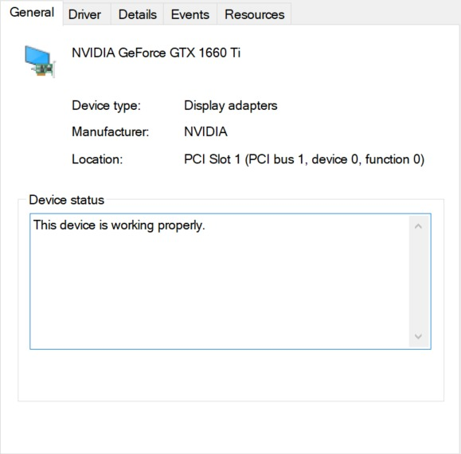

# gpu_setup_in_windows

1. check gpu 

2. install cuda version

3. download and install cuda from 

https://developer.nvidia.com/cuda-downloads?target_os=Windows&target_arch=x86_64&target_version=11&target_type=exe_local

when install cuda, remember to choose the right device as you checked in step 1

4. check your version of tensorflow

and find the corresponding version of cudnn from https://www.tensorflow.org/install/source_windows#gpu

5. download cudnn package of the correct version from https://developer.nvidia.com/rdp/cudnn-archive#a-collapse811-111 

